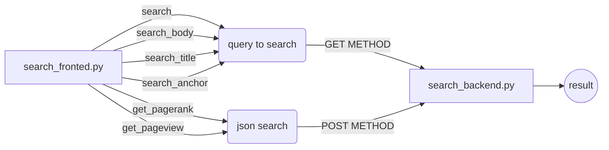

# $\color{blue}{IR-Project_Wiki-Search-Engine}$


A search engine that allows users to search through Wikipedia articles and find the most relevant results.

## Description
Our project is a search engine that uses information retrieval techniques to search through Wikipedia articles and find the most relevant results. It utilizes BM25 algorithm to rank the results and provide the user with the best match for their query.


## Installation
To run this project, you'll need to have Python 3.x installed on your system.

1. Clone the repository to your local machine
```
git clone https://github.com/trickdeath0/IR-Project_Wiki-Search-Engine.git
```

2. Navigate to the project directory
```
cd IR-Project_Wiki-Search-Engine
```

3. Install the required libraries
```
pip3 install pyspark
```

4. Run the search engine
```
python3 search_frontend.py
```


## About files we included in:
### search_fronted.py
The main module, You can find here the required functions implemented.

### search_backend.py
Functionality implementation for search functions:
1. search - The function uses the bm25 algorithm with division between body and title.
* 
  * Using the NLTK package, we tokenization the queries.
  * searching by the body of the document:
    * We perform a calculation of BM25 and save the result in the dictionary
  * searching by the title of the document:
    * We count for each document how many separate words from the query are in its title.
  * A combination into one dictionary for the two results and sorting after we returned and retrieves the 100 best results.

2. search_body - cosine similarity using tf-idf on the body of articles.
3. search_title - binary ranking using the title of articles.
4. search_anchor - binary ranking using the anchor text.
5. get_pagerank - ranking by PageRank.
6. get_pageview - anking by article page views.





## Examples
Here is an example of a query and its results:

Query: "take on me"
```
http://104.198.158.156:8080/search_body?query=take on me
```


Query: "backstreet boys"
```
http://104.198.158.156:8080/search?query=backstreet%20boys
```


#### To run get_pagerank or get_pageview
```
import requests
res = requests.post('http://IP:8080/get_pagerak', json=[1,2,3])
print(res.json())
```


```
import requests
res = requests.post('http://IP:8080/get_pageview', json=[1,2,3])
print(res.json())
```


### Changelog
* v1.0: Initial release


## 🔗 Links
Shay Giladi:
[](https://www.linkedin.com/in/shay-giladi/)

Oran Becker:
[](https://www.linkedin.com/in/oran-becker-01a82923b/)


